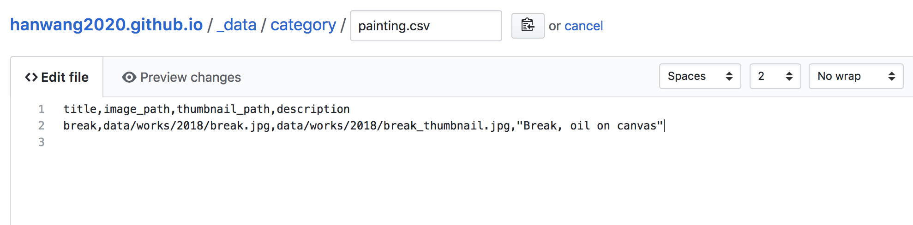
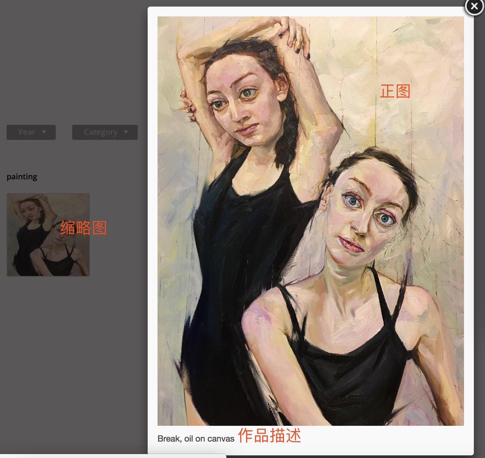

# Overview

use [chiharu-shitota website](http://www.chiharu-shiota.com/en/) to create personal website.

# 编辑Painting页面

1. 打开[painting.csv](https://github.com/hanwang2020/hanwang2020.github.io/edit/master/_data/category/painting.csv)
2. 输入标题，图片路径，缩略图路径，作品描述。如下图。
   
3. painting条目和网页的对应图
   

